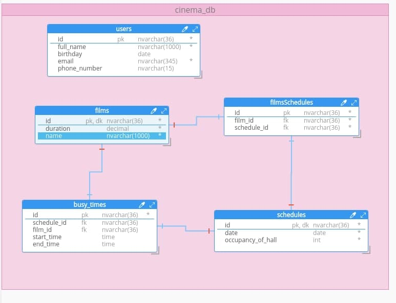

# PProgramming
Aplied programming
# 1st Lab
1. git clone (of course you did this:^])
2. pip install pipenv==2018.11.26
3. pyenv install 3.8.2
4. pyenv local 3.8.2 ( check by: "pyenv local" on this folder)
5. pipenv --python {python 3.8.2 folder}
6. pipenv install
7. pipenv shell
8. python app.py
### P.S. Cntrl+Z will close project and type exit to close virtual environment
Good luck!)

### Add environment variables for db

1. Create .env file in root folder
2. Add variables to this file
`
USER="root"
PASSWORD="root"
HOST="localhost"
PORT="3306"
`
3. Apply migration:  alembic upgrade head
4. Add migration: alembic revision --autogenerate -m "{Name}"

### Db schema 

